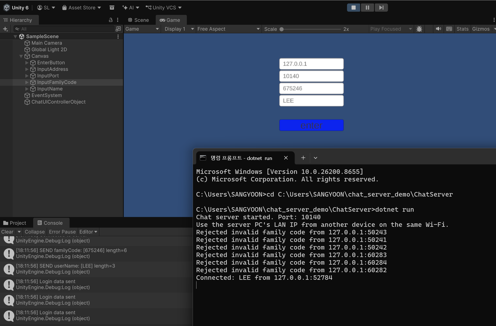
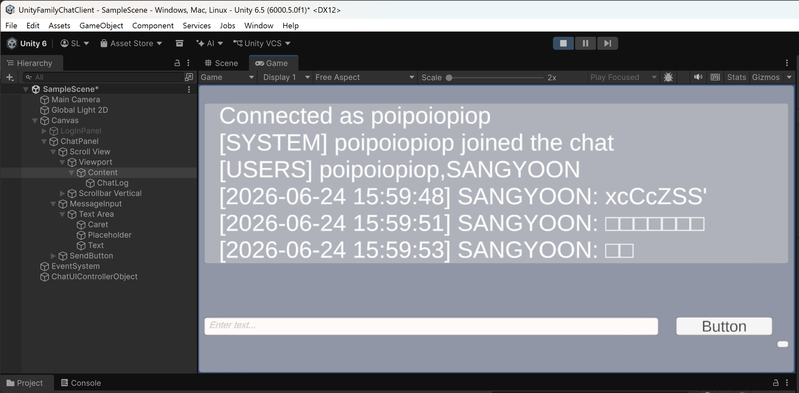
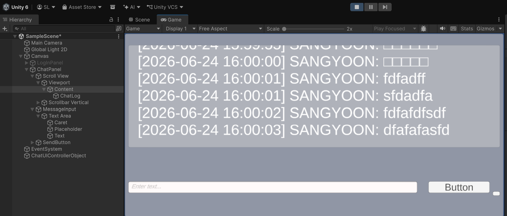

# Unity 채팅 클라이언트

C#/.NET 기반 TCP 채팅 서버와 연동되는 Unity 채팅 클라이언트 프로토타입입니다.

Unity UI에서 서버 주소, 포트, 가족코드, 닉네임을 입력하면 TCP 서버에 접속하고, 서버는 가족코드 인증과 닉네임 등록을 거친 뒤 채팅방 입장을 허용합니다. 입장 후에는 서버로부터 시스템 메시지, 접속자 목록, 채팅 메시지를 수신하여 Unity 화면에 표시하고, 입력창과 전송 버튼을 통해 메시지를 서버로 전송합니다.

## 개발 목적

기존 콘솔 기반 TCP 채팅 클라이언트를 Unity 환경으로 확장하여, 게임 클라이언트에서 서버에 접속하고 데이터를 주고받는 흐름을 직접 구현하는 것을 목표로 했습니다.

이를 통해 Unity UI 구성, 버튼 이벤트 처리, TCP 서버 접속, 로그인 정보 전송, 서버 메시지 수신 및 화면 표시 흐름을 학습했습니다.

## 주요 기능

* 서버 주소, 포트, 가족코드, 닉네임 입력
* C# TCP 서버 접속
* 가족코드 인증 정보 전송
* 닉네임 등록 요청
* 채팅 메시지 송신
* 서버 메시지 수신 및 Unity UI 표시
* 시스템 메시지 및 접속자 목록 표시
* Scroll View를 이용한 채팅 로그 표시

## 구현 흐름

1. 사용자가 Unity 로그인 화면에서 서버 주소, 포트, 가족코드, 닉네임을 입력합니다.
2. Enter 버튼을 누르면 `TcpClient`를 통해 서버에 접속합니다.
3. 클라이언트는 서버가 요구하는 순서에 맞춰 가족코드와 닉네임을 전송합니다.
4. 서버에서 인증과 닉네임 등록이 완료되면 채팅 화면으로 전환됩니다.
5. 이후 사용자가 입력한 메시지를 서버로 전송하고, 서버에서 받은 메시지를 채팅 로그에 표시합니다.

## UI 개선

초기 구현에서는 채팅 메시지가 누적될수록 텍스트가 화면 아래로 밀려나 전체 내용을 확인하기 어려운 문제가 있었습니다.

이를 해결하기 위해 Unity의 `Scroll View`를 도입하여 채팅 로그 영역을 구성했습니다. 메시지가 많아져도 스크롤을 통해 이전 메시지를 확인할 수 있도록 했고, 채팅창이 화면 밖으로 벗어나는 문제를 완화했습니다.

## 실행 화면

### 서버 접속 성공

### 채팅 화면

## 사용 기술

* Unity
* C#
* TextMeshPro
* TCP Socket
* `TcpClient`
* `StreamReader`
* `StreamWriter`
* Unity UI
* Scroll View

## 프로젝트에서 배운 점

이 프로젝트를 통해 Unity 클라이언트가 단순히 화면을 표시하는 역할만 하는 것이 아니라, 서버와 통신하며 인증 정보와 사용자 입력을 주고받는 흐름을 직접 구현해볼 수 있었습니다.

또한 채팅 로그가 누적되면서 UI가 깨지는 문제를 경험했고, Scroll View를 적용해 메시지 표시 영역을 개선했습니다. 이를 통해 서버 통신뿐만 아니라, 실제 사용자가 보는 화면에서 발생하는 UI 문제를 발견하고 수정하는 과정도 학습했습니다.

## 향후 개선 방향

* 로그인 성공/실패 메시지에 따른 화면 전환 처리 보강
* 서버 연결 실패 시 사용자 안내 메시지 표시
* 채팅 메시지 자동 스크롤 처리
* 접속자 목록 UI 분리
* Android 환경에서의 접속 테스트
* 서버의 DB 저장 및 인증 보안 기능과 연동

## 연동 서버

이 클라이언트는 가족코드 인증 기능이 포함된 C# TCP 채팅 서버와 연동됩니다.

- [C# TCP 채팅 서버 - 가족코드 인증](../family-code)## 연동 서버

